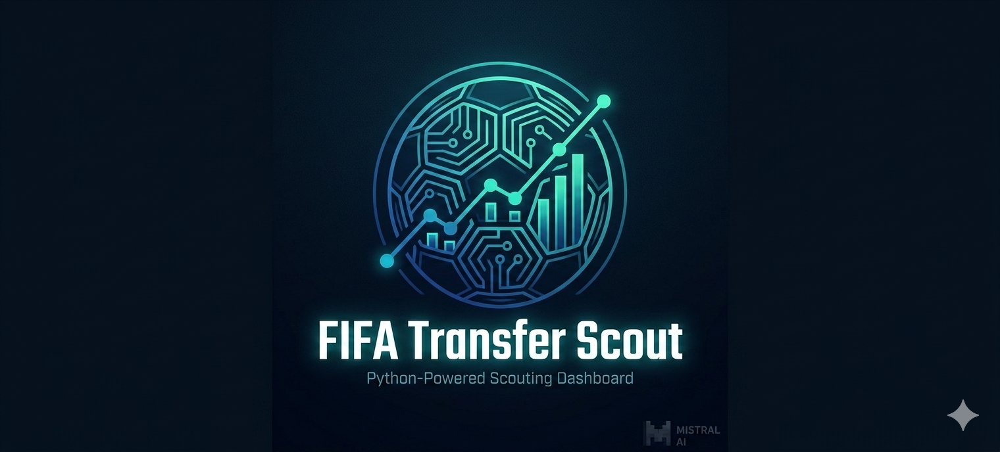

# FIFA Transfer Scout

Explore and analyze FIFA player data through an interactive dashboard with AI-powered insights. This project identifies "Hidden Gems" and top talent using FIFA 22 data, FastAPI, and Mistral AI, demonstrating a full-stack integration of data science, DevOps, and Large Language Models (LLM).



## Features

- **AI Scout Assistant:** Ask natural language questions about player data using Mistral AI (RAG-light).
- **Hidden Gem Finder:** Identify undervalued players based on market value vs. overall rating using an interactive Plotly scatter chart.
- **World Map Distribution:** Visual exploration of player nationalities using GeoPandas.
- **Career Peak Analytics:** Discover peak age and average ratings per position.
- **Watchlist:** Save and manage players of interest across sessions, persisted in SQLite.
- **Scout History:** Review previous AI scout queries and responses, persisted in SQLite.
- **Live Football News:** Browse the latest football transfer news and headlines powered by the Football-Data API.
- **Dockerized Architecture:** Fully containerized microservices (API + Frontend) with persistent SQLite volume.

## Tech Stack

- **Backend:** FastAPI (Python 3.14)
- **Frontend:** Streamlit
- **AI Engine:** Mistral AI API
- **Database:** SQLite (persistent via Docker volume)
- **DevOps:** Docker, Docker Compose, uv (fast package manager)
- **Data Science:** NumPy, Pandas, Matplotlib, GeoPandas, Plotly

## Quick Start with Docker (Recommended)

1. Clone the repository:
```bash
git clone https://github.com/CodeByNajib/fifa-transfer-scout.git
cd fifa-transfer-scout
```

2. Configure environment variables - create a `.env` file in the root directory:
```
MISTRAL_API_KEY=your_actual_key_here
FOOTBALL_DATA_API_KEY=your_actual_key_here
```

3. Spin up the containers:
```bash
docker compose up --build
```

- Dashboard: `http://localhost:8501`
- API Docs: `http://localhost:8000/docs`

## Manual Setup (Local Development)

1. Set up the environment:
```bash
uv venv venv
source venv/bin/activate
uv pip install -r requirements.txt
```

2. Run backend (Terminal 1):
```bash
uvicorn app.api.main:app --reload
```

3. Run frontend (Terminal 2):
```bash
streamlit run app/frontend/streamlit_app.py
```

## Project Structure

```
.
├── app/
│   ├── api/
│   │   ├── main.py        # FastAPI endpoints
│   │   ├── data.py        # Data loading and analysis logic
│   │   ├── database.py    # SQLite persistence (watchlist + scout history)
│   │   ├── scout_ai.py    # Mistral AI RAG-light integration
│   │   └── Dockerfile
│   ├── frontend/
│   │   ├── streamlit_app.py  # Streamlit dashboard
│   │   └── Dockerfile
│   └── tests/
│       ├── test_data.py      # Pytest suite for data logic
│       └── test_database.py  # Pytest suite for database logic
├── assets/                    # Static assets (images, icons)
├── constants.py               # Shared constants
├── utils.py                   # Shared utility functions
├── docker-compose.yml
├── requirements.txt
└── README.md
```

## API Endpoints

### Players
- `GET /players/top/{position}` - Get top-rated players by position
- `GET /players/undervalued` - Find high quality, low cost players
- `GET /players/peak-age` - Get peak age statistics per position
- `GET /players/nationality` - Get player counts per country
- `POST /players/ask-scout` - Chat with the AI scout assistant
- `GET /transfers/news` - Fetch live match data from external API

### Watchlist
- `GET /watchlist` - Retrieve saved players
- `POST /watchlist` - Add a player to the watchlist
- `DELETE /watchlist/{player_id}` - Remove a player from the watchlist

### Scout History
- `GET /scout/history` - Retrieve previous AI scout queries
- `DELETE /scout/history` - Clear all scout history